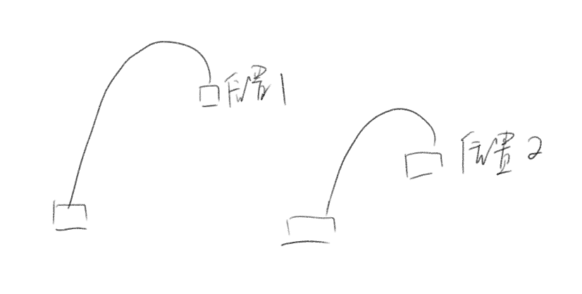

# 1_3-parabola
用两种方式实现的抛物线 第一种方式是：   利用系统自带的加速减速做的，   另外一种方式是：   利用物理知识，抛物线的做的，通过计算初始速度和加速度，计算某一个时刻的位移。。

## 加入购物车1
 
分为两个属性动画
* A->B 
  translationX 为匀速 
  translationY 为减速 
* B->C 
  translationX 为匀速 
  translationY 为加速  

## 加入购物车2
 
为物理的速度加速度的知识实现的抛物线。
* translationX 为匀速。
* translationY 为匀加速运动。 初始速度为负值，加速度为正值。
  * 已知S、t、加速度a。可以求出V0。
  * 设置 TypeEvaluator 根据时间的百分比，根据上图的公式，计算S的值，从而计算出translationY的值。
* 问题： 
   
   * 1.加入购物车的位置可能不一样，可能会冲出屏幕。
   * 2.加入购物车的位置可能不一样，时间应该一致吗？
   * 这两个问题，等真正用的时候，再继续思考了。
